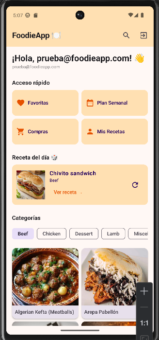
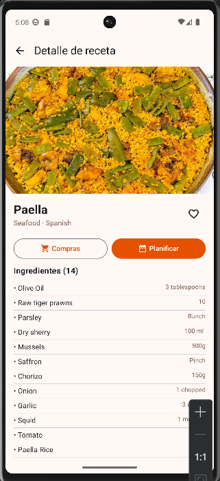
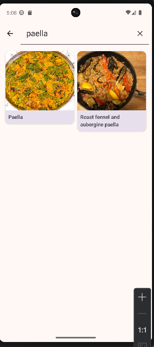
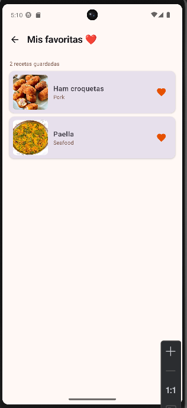
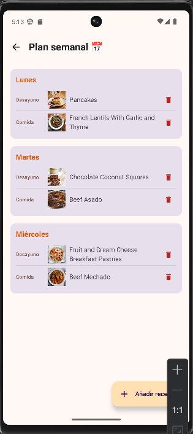
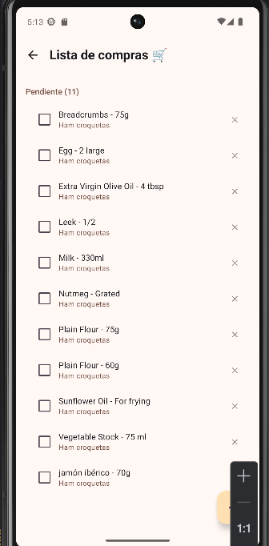
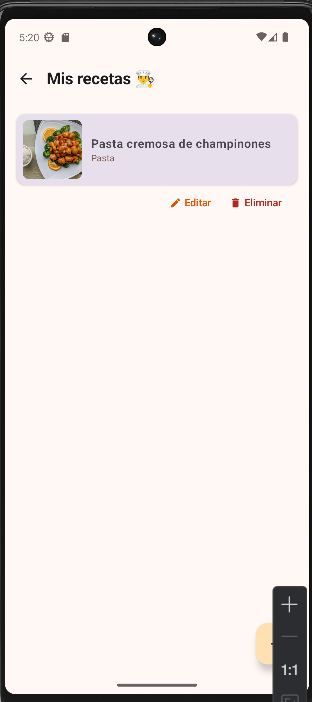

# 🍽️ FoodieApp

**Proyecto Final PMDM + PSP - 2º DAM**  
Aplicación Android nativa para descubrir recetas, planificar comidas semanales y gestionar la lista de la compra.

---

## 📱 Descripción

FoodieApp es una aplicación de cocina completa que permite:

- Explorar recetas desde la API pública de **TheMealDB**
- Guardar recetas como **favoritas**
- Planificar comidas por **día y tipo** (desayuno, comida, cena)
- Generar automáticamente la **lista de la compra** desde cualquier receta
- **Crear y editar recetas propias** con CRUD completo
- Separación de datos por usuario autenticado con **Auth0**

---

## 🛠️ Tecnologías utilizadas

| Tecnología | Uso |
|---|---|
| **Jetpack Compose** | UI declarativa sin XML |
| **Navigation Compose** | Navegación entre pantallas |
| **MVVM + Clean Architecture** | Separación en capas |
| **Room** | Base de datos local |
| **Retrofit2 + Gson** | Consumo de API REST |
| **Auth0** | Autenticación segura |
| **Hilt** | Inyección de dependencias |
| **Coroutines + Flow** | Operaciones asíncronas reactivas |
| **Coil** | Carga de imágenes desde URL |
| **Material Design 3** | Tema personalizado naranja |

---

## 📋 Pantallas

| Pantalla | Funcionalidad |
|---|---|
| **Login** | Autenticación con Auth0 |
| **Home** | Categorías, receta del día y accesos rápidos |
| **Búsqueda** | Buscar recetas por nombre con debounce |
| **Detalle** | Ingredientes, instrucciones, favorito, planificar, compras |
| **Favoritas** | Recetas guardadas en local |
| **Plan semanal** | Organización por día y tipo de comida |
| **Lista de compras** | Ingredientes pendientes y completados |
| **Mis recetas** | CRUD de recetas creadas por el usuario |
| **Formulario** | Crear o editar receta con validación |

---

## 🏗️ Arquitectura

Estructura basada en **MVVM + Clean Architecture**:

```
app/
├── data/
│   ├── local/         # Room: entities, DAOs, database
│   ├── remote/        # Retrofit: API service, DTOs, mappers
│   └── repository/    # Repositorios: fuente única de verdad
├── domain/
│   ├── model/         # Modelos de dominio
│   └── usecase/       # Casos de uso (uno por acción)
├── ui/
│   ├── screens/       # Pantallas Composable
│   ├── components/    # Componentes reutilizables
│   ├── navigation/    # NavHost y rutas
│   ├── theme/         # Colores y tema Material 3
│   └── viewmodel/     # ViewModels con StateFlow
└── di/                # Módulos de Hilt
```

**Principios aplicados:**
- La UI solo observa estado, nunca hace lógica
- El ViewModel expone `StateFlow` y recibe eventos de la UI
- El Repository decide si los datos vienen de la API o de Room (cache-first)
- Todas las operaciones lentas usan Coroutines y no bloquean el hilo principal

---

## 🗄️ Base de datos (Room)

### Entidades

| Tabla | Descripción |
|---|---|
| `recipes` | Recetas de la API y recetas propias del usuario |
| `meal_plans` | Entradas del planificador semanal |
| `shopping_items` | Items de la lista de la compra |

- CRUD completo en todas las entidades
- `Flow` en todos los DAOs para actualizaciones reactivas en tiempo real
- Búsqueda con `LIKE` por nombre y categoría (`@Query`)
- Datos separados por `userId` de Auth0

---

## 🌐 API — TheMealDB

Base URL: `https://www.themealdb.com/api/json/v1/1/`

| Endpoint | Descripción |
|---|---|
| `GET search.php?s=` | Buscar recetas por nombre |
| `GET lookup.php?i=` | Detalle completo por ID |
| `GET categories.php` | Lista de categorías |
| `GET filter.php?c=` | Recetas por categoría |
| `GET random.php` | Receta aleatoria del día |

Todos los endpoints manejan tres estados: **Loading / Success / Error**  
En caso de error de red la app no se cierra, muestra un mensaje descriptivo.

---

## 🔐 Autenticación — Auth0

- Login y logout mediante navegador con `WebAuthProvider`
- Tokens gestionados en memoria (no se persisten en texto plano)
- Rutas protegidas: sin sesión activa redirige siempre a Login
- El `userId` del token se usa para separar datos entre usuarios
- Muestra nombre y email del usuario autenticado en Home

---

## ⚙️ Instalación

### Requisitos
- Android Studio Hedgehog o superior
- JDK 11
- Android SDK 26+

### Pasos

1. Clona el repositorio:
```bash
git clone https://github.com/xmeyzzzenx/FoodieApp.git
```

2. Abre el proyecto en **Android Studio**

3. Crea el fichero `local.properties` en la raíz del proyecto y añade:
```properties
AUTH0_CLIENT_ID=GLlPFFy9Sz9K0pwML1eREsf4gnBtfggf
AUTH0_DOMAIN=dev-qjujhqmlbgx8725a.eu.auth0.com
```

4. Haz **Sync Project with Gradle Files**

5. Ejecuta en emulador o dispositivo físico con ▶ **Run**

> ⚠️ Sin el `local.properties` el proyecto no compilará. Este fichero no se sube al repositorio por seguridad.

---

## 🔑 Credenciales de prueba

Puedes crear una cuenta nueva directamente desde la pantalla de login de Auth0, o usar esta cuenta de prueba:

| Campo | Valor                |
|---|----------------------|
| **Email** | prueba@foodieapp.com |
| **Contraseña** | P@ssword1234         |

> La API de TheMealDB es pública y no requiere clave.

---

## 👩‍💻 Autora

**Ximena Meyzen Calderón**  
2º DAM — Proyecto Final PMDM + PSP — 2025/2026

## 📸 Capturas de pantalla

<p float="left">
  
  
  
  
</p>
<p float="left">
  
  
  
  
</p>